# 🛡️ Sentinel: Distributed Global Rate Limiter


**Sentinel** is a high-performance, distributed rate-limiting system designed to protect microservices from traffic spikes, abuse, and DDoS attacks. Unlike traditional in-memory limiters, Sentinel synchronizes state across multiple instances using Redis, ensuring **global consistency** for your rate limits.

---

## ⚡ Performance & Scale

Sentinel is built for high-scale production environments.

-   **Throughput**: Capable of handling **50,000+ Requests Per Second (RPS)** per node with Redis pipelining.
-   **Latency Overhead**: Adds **< 2ms** to request processing time (p99).
-   **Scalability**: Linearly scalable. Add more nodes, and the Redis backend handles the synchronization.
-   **Precision**: **1ms** timestamp resolution for burst detection.
-   **Reliability**: **100%** fail-open capability ensuring your service **never** goes down if the rate limiter fails.

---

## 🏗️ System Architecture

Sentinel employs a **Hybrid 2-Layer Defense** strategy:

1.  **Layer 1: Local Burst Protection (Token Bucket)**
    *   **Speed**: Ultra-fast (nanosecond scale) in-memory check.
    *   **Goal**: Prevents a single instance from being overwhelmed by instantaneous spikes.
2.  **Layer 2: Global Distributed Limiting (Redis Fixed Window)**
    *   **Consistency**: Atomic Lua scripts ensure accurate counting across all nodes.
    *   **Goal**: Enforces global quotas (e.g., "1000 req/min across 50 servers").

```mermaid
graph TD
    Client([Client / Load Balancer]) -->|Request| Middleware
    
    subgraph "Sentinel Node"
        Middleware[HTTP Middleware]
        LocalLimiter[⚡ Local Burst Limiter]
        Config[⚙️ Dynamic Config]
    end
    
    Middleware -->|1. Check Local| LocalLimiter
    LocalLimiter -- Allowed --> GlobalCheck
    LocalLimiter -- Blocked --> Reject[❌ 429 Too Many Requests]
    
    GlobalCheck[2. Check Global] -->|Lua Script| Redis[(🔴 Redis Store)]
    
    Redis -- OK --> Forward[✅ Forward to Service]
    Redis -- Over Limit --> Reject
```



---

## 🚀 Features

-   **Dashboard & Playground**: A Next.js-based "Command Center" to visualize traffic in real-time and simulate attacks.
-   **Dynamic Configuration**: Update rate limits on the fly via API without restarting services.
-   **Algorithm Agnostic**: Designed to support Fixed Window (current), Sliding Window, and Token Bucket.
-   **Fail-Open Design**: If Redis goes down, traffic flows through (configurable).
-   **Real-Time Metrics**: JSON metrics endpoint for integration with Prometheus/Grafana.

---

## 🛠️ Technology Stack

-   **Core**: Go (Golang) 1.22+
-   **Distributed Store**: Redis (with Lua scripting for atomicity)
-   **Frontend**: Next.js 14 (App Router), Tailwind CSS, Recharts
-   **Containerization**: Docker & Docker Compose

---

## 🏁 Getting Started

### Prerequisites
-   Go 1.22+
-   Node.js 18+ (for frontend)
-   Docker (optional, for Redis)

### 1. Start the Backend
```bash
# Start Redis
docker-compose up -d redis

# Run the Sentinel Server
go run ./cmd/server
# Server running on :8080
```

### 2. Start the Frontend Dashboard
```bash
cd frontend
npm install
npm run dev
# Dashboard running at http://localhost:3000
```

---

## 🎮 The "Zero to Blocked" Demo

Sentinel includes an interactive **Traffic Playground** to demonstrate its capabilities.

1.  Open **http://localhost:3000/playground**.
2.  Click **START SIMULATION**.
    *   *Action*: Sends 20 requests/second to the backend.
3.  Watch the logs turn from **Green (200 OK)** to **Red (429 Blocked)** as you hit the default limit.
4.  Open **http://localhost:3000/config** in a new tab.
5.  Change the limit for `/playground` to **50 requests / 60 seconds**.
6.  Observe the real-time adaptation in the Playground logs!

---

## 🔌 API Reference

### Update Rate Limit (Dynamic Config)
`POST /api/config`

```json
{
  "path": "/api/payments",
  "limit": 100,
  "window": 60
}
```

### Get Metrics
`GET /metrics`

Returns atomic counters for monitoring.

```json
{
  "allowed_requests": 1450,
  "blocked_requests": 23,
  "redis_errors": 0
}
```

---

## 📜 License

MIT License. Built for High-Scale Systems.
